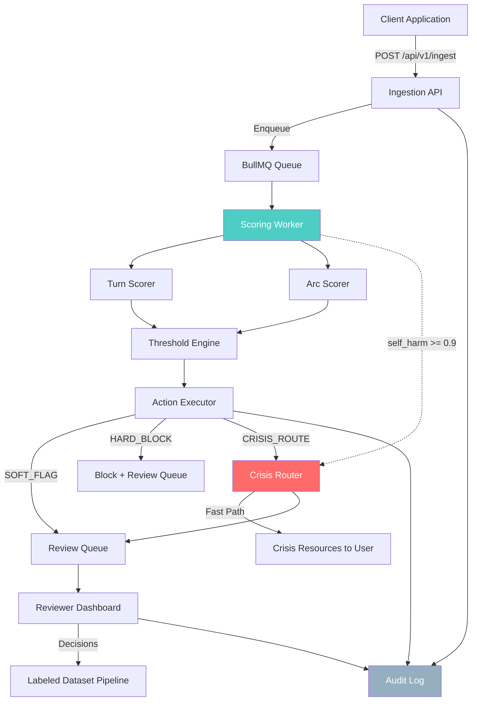

# SentinelArc

**Real-time AI safety scoring and crisis routing for conversational AI platforms.**

SentinelArc is a multi-tenant SaaS platform that monitors conversations between users and AI companions for safety concerns. It scores each message (turn-level) and conversation trajectory (arc-level), triggers appropriate actions when thresholds are breached, and provides crisis resources immediately when self-harm or other urgent signals are detected.

SentinelArc is a **triage and routing** system, not a diagnostic tool. It identifies conversations that need human attention, routes crisis situations to appropriate resources, and provides labeled data for continuous improvement. It does not make clinical assessments or replace professional judgment.

## Architecture



**Key architectural decisions:**

- The **Crisis Router** has a fast-path directly from the scoring worker that bypasses normal queue ordering. If `self_harm >= 0.9`, crisis resources are delivered immediately, before the rest of the scoring pipeline completes.
- The **Audit Log** is an append-only store with hash-chaining for tamper evidence. Every state change across the system writes to the audit log.
- The **Reviewer Dashboard** reads from the review queue. Human decisions feed back into the labeled dataset pipeline for future model training.

## Tech Stack

| Layer        | Technology                                    |
|--------------|-----------------------------------------------|
| Framework    | Next.js 14 (App Router)                       |
| Language     | TypeScript (strict mode)                      |
| Database     | PostgreSQL via Prisma ORM                     |
| Queue        | BullMQ (Redis-backed)                         |
| Auth         | NextAuth.js (session) + API keys (ingestion)  |
| Billing      | Stripe (subscriptions + usage metering)       |
| UI           | shadcn/ui + Tailwind CSS                      |
| Testing      | Jest + fast-check (property-based)            |

## Local Development Setup

### Prerequisites

- Node.js 22+
- PostgreSQL 15+
- Redis 7+

### Installation

```bash
# Clone the repository
git clone https://github.com/your-org/sentinelarc.git
cd sentinelarc

# Install dependencies
npm install

# Copy environment variables
cp .env.example .env
# Edit .env with your local database/redis URLs

# Generate Prisma client
npx prisma generate

# Run database migrations
npx prisma migrate dev

# Start the development server
npm run dev
```

### Starting the Worker

The scoring worker runs as a separate process:

```bash
npx tsx src/workers/scoring-worker.ts
```

### Environment Variables

See [`.env.example`](.env.example) for the full list. Key variables:

| Variable              | Required | Description                           |
|-----------------------|----------|---------------------------------------|
| DATABASE_URL          | Yes      | PostgreSQL connection string          |
| NEXTAUTH_SECRET       | Yes      | Session signing secret                |
| NEXTAUTH_URL          | Yes      | Application base URL                  |
| REDIS_URL             | Yes      | Redis connection for BullMQ           |
| STRIPE_SECRET_KEY     | Yes      | Stripe API key for billing            |
| STRIPE_WEBHOOK_SECRET | Yes      | Stripe webhook verification           |
| OPENAI_API_KEY        | No       | Optional: enhanced scoring via OpenAI |
| LOG_LEVEL             | No       | Minimum log level (default: info)     |
| ALERT_WEBHOOK_URL     | No       | Webhook for real-time alerts          |

## Testing

```bash
# Run all tests
npm test

# Run tests in watch mode
npm run test:watch

# Run with coverage
npm test -- --coverage
```

### Test Categories

- **Unit tests** (`tests/lib/`): Core business logic (scoring, thresholds, crisis routing, audit)
- **API tests** (`tests/api/`): HTTP endpoint behavior with mocked dependencies
- **Integration tests** (`tests/integration/`): Full pipeline from ingestion through action execution

### Key Test Properties

- Crisis routing never throws (always delivers resources)
- Audit log entries are immutable and hash-chained
- Scoring is deterministic for the same input
- Multi-tenant data isolation is enforced at every layer

## Decision Log

### Why is crisis routing decoupled from the human review queue?

Crisis routing must deliver resources to a user in distress within single-digit milliseconds. The human review queue can experience variable latency due to queue depth, worker availability, or database contention. If crisis routing depended on the review queue, a queue backup could delay life-critical resource delivery.

The crisis router operates synchronously with a circuit breaker pattern. It returns crisis resources immediately and enqueues a review item as a fire-and-forget side effect. Even if the review queue, database, or any other downstream system is completely unavailable, the user still receives crisis resources.

### Why is the system framed as triage/routing, not diagnosis?

SentinelArc identifies conversations that may need intervention and routes them to appropriate resources or human reviewers. It does not:

- Make clinical assessments about user mental health
- Diagnose conditions or disorders
- Replace professional crisis counselors or therapists
- Make definitive safety determinations

This framing is both a legal/liability consideration and an ethical one. Pattern-based and rule-based scoring (even with ML enhancement) cannot replace professional clinical judgment. The system's role is to ensure that no conversation needing attention goes unnoticed, while accepting that false positives are preferable to false negatives in safety-critical contexts.

### Why does arc-level scoring exist alongside turn-level?

A single message (turn) can appear benign in isolation while a conversation trajectory (arc) shows concerning escalation. Examples:

- Gradual normalization of harmful content over many turns
- Emotional escalation patterns (each turn slightly more distressed)
- Grooming patterns that only emerge over conversation history

Arc scoring uses a sliding window of recent turn scores to detect these trajectory patterns. It complements turn-level scoring rather than replacing it.

### Why does the audit log use hash chaining?

The audit log serves as a legal and compliance record. Hash chaining (each entry includes the hash of the previous entry) provides:

- **Tamper evidence**: Any modification to a historical entry breaks the chain
- **Ordering proof**: The sequence of events is cryptographically verified
- **Compliance**: Meets requirements for immutable audit trails in regulated contexts (SOC 2, HIPAA-adjacent)

## Known Limitations (v1)

### Pattern-Based Detection

The v1 scoring system uses pattern matching and rules (with optional OpenAI Moderation API enhancement) rather than a trained ML model. This means:

- **False positive rate**: Approximately 5-15% depending on category. Clinical/medical discussions, fiction writing, news reporting, and academic content can trigger false positives.
- **False negative rate**: Novel phrasing, coded language, or context-dependent threats may not be detected. The system performs best on direct/explicit content.
- **No nuance model**: The scorer cannot distinguish between "I want to hurt myself" (genuine distress) and "the character in my story wants to hurt herself" (fiction) without additional context signals.

### Arc Scoring Window

- The arc scorer uses a sliding window of the most recent 10 turns. Patterns that develop over longer conversations (50+ turns) may not be captured.
- Arc scoring triggers every 5 turns or when a turn score exceeds 0.5. This means short conversations (< 5 turns) rely entirely on turn-level scoring.
- The escalation detection is based on score trends, not semantic understanding of conversation flow.

### No Trained ML Model (v1)

The v1 system uses:
- Keyword/pattern matching with weighted scores
- External API calls (OpenAI Moderation) when available
- Rule-based threshold logic

A future v2 would incorporate a fine-tuned model trained on the labeled dataset produced by human reviewers. The labeled dataset pipeline exists specifically to enable this transition.

### Latency Characteristics

- Turn scoring is asynchronous (queued via BullMQ). Real-time blocking requires the crisis fast-path or pre-scoring.
- Under high load, queue depth can increase scoring latency from ~100ms to seconds.
- The crisis fast-path is the only guaranteed low-latency path (< 5ms p99).

### Single-Region Deployment

v1 assumes single-region deployment. Multi-region considerations (data residency, failover, regional crisis resources) are out of scope.
